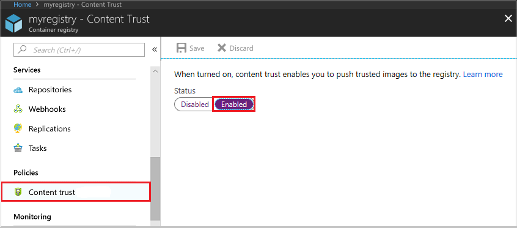

[<< home](../README.md)

# How to prepare DCT keys to work with ACR signing

### 1. Enable content trust for your ACR



### 2. This repo contains helper script to prepare DCT keys to signing images

You need to have at least `AcrPush`, `AcrImageSigner` [roles](https://learn.microsoft.com/en-us/azure/container-registry/container-registry-roles)

[./hacks/acr_prepare_keys.sh](../hacks/acr_prepare_keys.sh)
```
Usage: ./acr_prepare_keys.sh <acr-name> <repository> <registry-passphrase> <repository-passphrase> <signer> [signer-private-key] [signer-public-key]

    <acr-name> - name of ACR repository, example: ${YELLOW}examplereg"
    <repository> - name of repository, example: ${YELLOW}nginx"
    <registry-passphrase> - passphrase for registry (root) key"
    <repository-passphrase> - passphrase for repository key"
    <signer> - name of signer, example: ${YELLOW}example_user"

    Optional:

    [signer-private-key] - path to existed signer private key file"
    [signer-public-key] - path to existed signer public key file"
```

When script finished, you got a special `artifacts` (./hacks/artifacts/) dir. 

You must save all the keys to safe place (azure key vault, e.g.):

1) your root (canonical) private`.key`
2) your target (repository) private`.key`
3) your user private`.key`
4) your user private`.key.base64` - to use with `acr-sign-push-action`
5) your public user key`.pub`
6) your registry`.crt`
7) your registry`.pub` - to use with [Connaisseur](https://github.com/sse-secure-systems/connaisseur) kubernetes admission controller or other container image trust and signature verification systems

This private keys also stored in your `~/.docker/trust/private` dir.

### Please, note:
* To prepare for signing **another repository within the same registry** - you must have root (1) private key in your `~/.docker/trust/private` dir, then run the helper script
* To create **another user within the same registry/repository** - you must have root(1) and target(2) private keys in your `~/.docker/trust/private` dir, then run the helper script
* To use **previously created user or another registry/repository** - you must also provide optional arguments with user's private(3) and public(5) keys